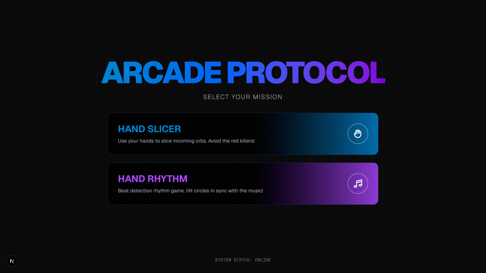

# 🎮 ARCADE PROTOCOL

Website game interaktif berbasis **Hand Tracking** (deteksi pergerakan tangan) menggunakan MediaPipe dan Next.js. Kamu bisa bermain game hanya dengan menggerakkan tangan di depan kamera!




## 🚀 Fitur Utama
- **Hand Slicer**: Iris bola-bola hijau yang jatuh dan hindari bom merah menggunakan jari telunjukmu!
- **Hand Rhythm**: Game ritme (mirip Osu!) di mana kamu harus menekan lingkaran sesuai ketukan musik.
- **Custom Music Analysis**: Di mode Hand Rhythm, kamu bisa upload lagu sendiri (.mp3, .wav, dll) dan sistem akan menganalisis BPM serta beat secara otomatis untuk membuat level game.
- **Real-time Dual Hand Tracking**: Mendukung deteksi hingga dua tangan sekaligus dengan feedback visual neon yang keren.

## 🛠️ Persyaratan Sistem
Sebelum menjalankan project ini, pastikan perangkatmu memenuhi syarat berikut:
- **Node.js**: Versi **v20 atau v22 (LTS)** sangat disarankan. 
  - *Catatan: Node v25 ke atas saat ini mungkin mengalami kendala dengan library native binding pada Windows.*
- **Kamera/Webcam**: Dibutuhkan untuk mendeteksi gerakan tangan.
- **Browser Modern**: Google Chrome atau Microsoft Edge disarankan untuk performa deteksi terbaik.

## 📦 Cara Instalasi & Menjalankan

1. **Clone Project**:
   ```bash
   git clone https://github.com/agungpriyatno/minigame.git
   cd minigame
   ```

2. **Instal Library**:
   Project ini sebenarnya menggunakan **Bun** untuk performa terbaik, tapi kamu juga bisa menggunakan **NPM**:
   ```bash
   npm install
   # ATAU jika menggunakan Bun
   bun install
   ```

3. **Jalankan Mode Pengembangan**:
   ```bash
   npm run dev
   # ATAU
   bun dev
   ```

4. **Buka Browser**:
   Akses `http://localhost:3000` untuk mulai bermain.

## ⚠️ Troubleshooting (Jika Error)
Jika muncul error **"Cannot find native binding"** di Windows:
1. Pastikan versi Node.js kamu bukan versi ganjil/instabil (gunakan v22 LTS).
2. Hapus folder `node_modules` dan `package-lock.json`.
3. Jalankan `npm install` kembali.
4. Jika masih berlanjut, sangat disarankan menggunakan [Bun](https://bun.sh/) karena Bun memiliki manajemen library native Windows yang lebih stabil untuk project ini.